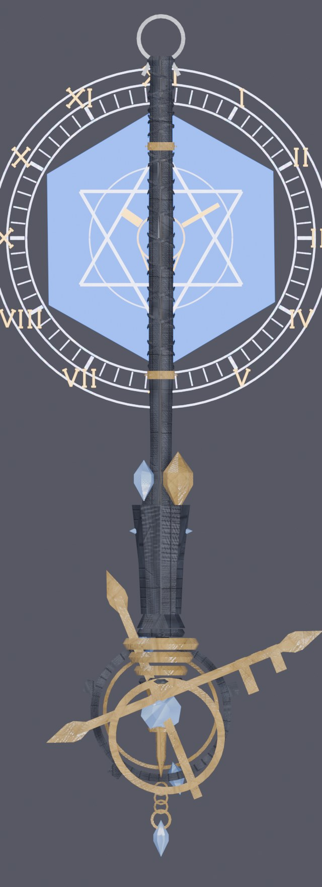

# 法杖盾斧

《怪物猎人 荒野》充能斧外观替换：日式魔女法杖 + 时钟法阵。

替换武器：**白炽斧耶利米 / 炽光斧耶利米**

## 下载

[RuneStaff-v1.0.zip](RuneStaff-v1.0.zip)

## 前置

- REFramework。没有它 `pak_mods` 不加载，mod 无效。
- REFramework → Advanced Options → 打开 **Alternate PAK Folder**。

## 安装

把 `RuneStaff-v1.0.zip` 拖进 Fluffy Mod Manager，启用。

## 效果

- 剑盾形态按住 R 防御：法阵出现
- 剑盾形态平时：法阵隐藏
- 斧形态：法阵常显

## 卸载

Fluffy 里取消勾选或删除。

## 排错

| 症状 | 处理 |
|---|---|
| 没有任何变化 | 检查 REFramework 和 Alternate PAK Folder |
| 杖身是默认材质 | 贴图没读到，反馈一下 |
| 防御时法阵不出 | 确认 `<游戏目录>\reframework\autorun\rune_guard_circle.lua` 在。日志：`<游戏目录>\reframework\data\rune_guard_circle.log` |
| 法阵闪烁 | 装过 ArmorVariantManager 且配过这把武器的显隐。删掉 `reframework\data\ArmorVariantManager\it0900_0021.json` |

不需要"防御时才显示"的话，删掉 `rune_guard_circle.lua`，法阵就常显。

## 许可

与 Capcom 无关联。《怪物猎人 荒野》及其资产版权归 Capcom。

`RuneStaff.pak` 是游戏原有资源的修改产物，请在自己拥有该游戏的机器上使用。

内置的 `rune_guard_circle.lua` 为本项目原创，MIT。
